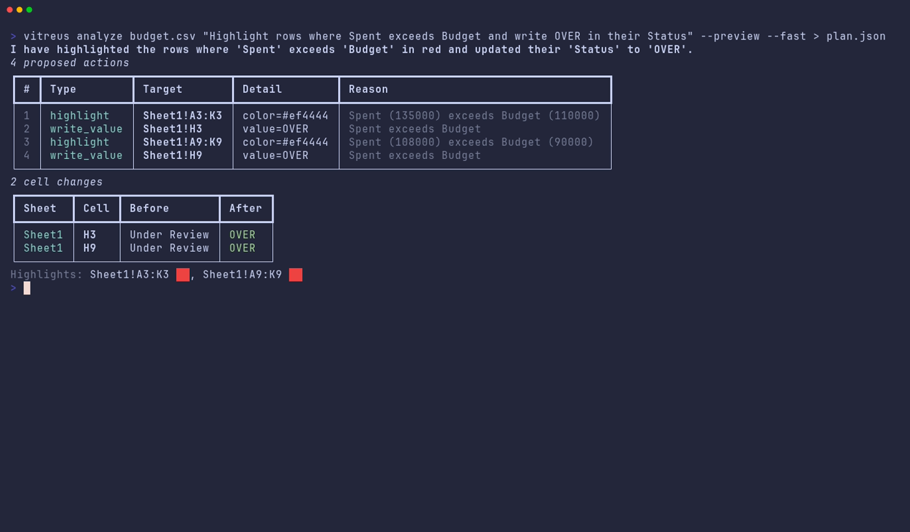
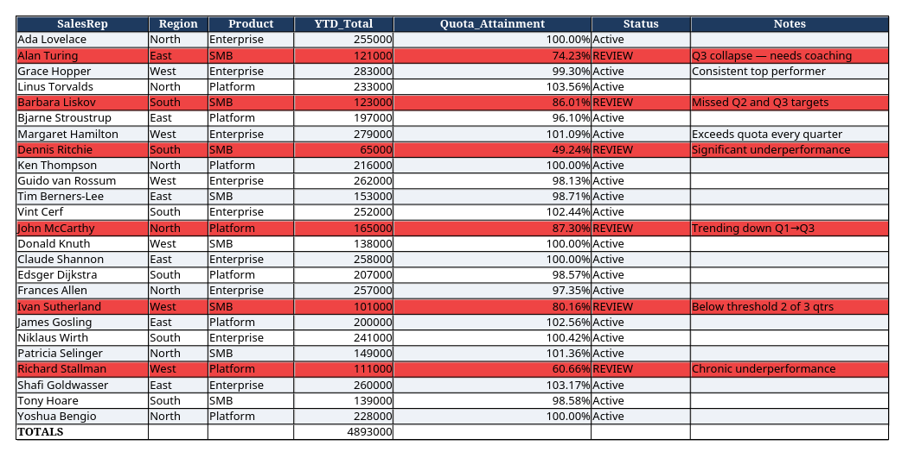
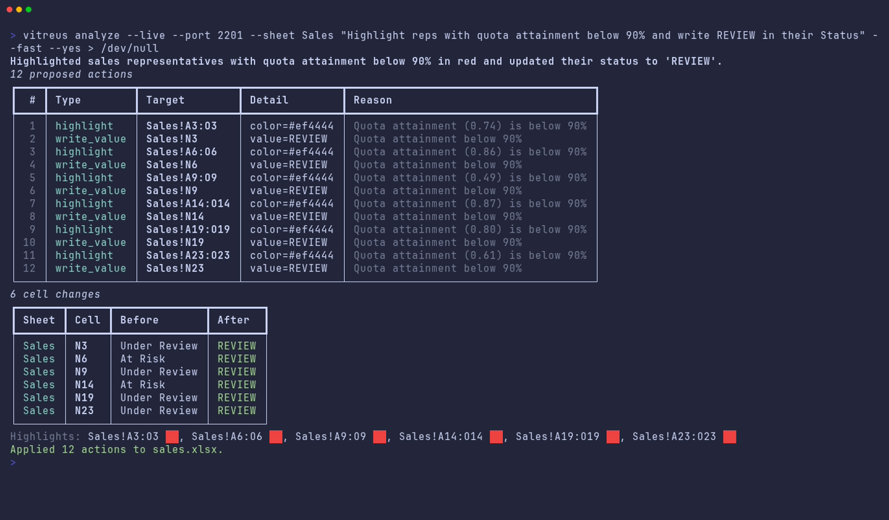
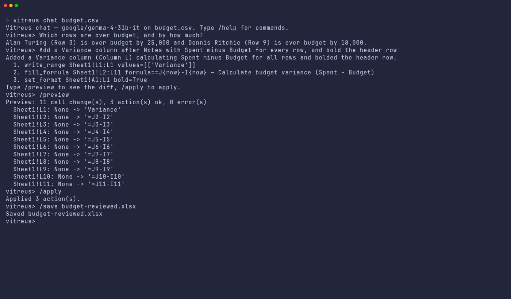

# Vitreus

<p align="center">
  
</p>

**Vitreus is a local-first spreadsheet intelligence agent powered by Gemma 4.** It inspects XLSX, CSV, stdin, image-derived tables, or live LibreOffice Calc documents, builds compact workbook context, and returns a validated JSON action manifest before anything is applied. The primary product path is private-by-default Ollama with `gemma4:31b`; `--fast` selects the `gemma4:e4b` drafter. Google AI Studio, OpenRouter, and OpenAI-compatible servers such as LM Studio, llama.cpp, or vLLM are optional secondaries; a deterministic fallback handles common review tasks when no model is available.

## 📺 Showcase


| Plan first: proposed actions and cell diff | The applied workbook, rendered by LibreOffice |
|:---:|:---:|
|  |  |
| **Live LibreOffice Calc (`--live`)** | **Chat REPL: ask, plan, `/preview`, `/apply`, `/save`** |
|  |  |

Every step above is a manifest first, then an apply. The recording machine had no GPU, so these were captured with the same Gemma 4 models served by Google AI Studio (`gemma-4-31b-it`; `--fast` selects `gemma-4-26b-a4b-it`); with Ollama running, the identical commands run fully local on `gemma4:31b` / `gemma4:e4b`.

## Architecture

```text
xlsx/csv/stdin/Calc
       |
       v
 WorkbookSnapshot
       |
       v
 Context builder
       |
       v
 SpreadsheetAgent (Gemma 4 + prompt tools)
       |        list_sheets / describe_sheet / get_range / find
       v
 Manifest v2 JSON (pydantic validated)
       |
       +--> WorkbookDriver (openpyxl) --> xlsx/csv
       |
       +--> UnoDriver (PyUNO bridge) ----> live Calc document
```

The model plans; Vitreus validates and executes. Manifests are always emitted first, highlights and non-obvious formulas need a `reason`, unsupported actions/ranges fail validation, and insufficient context should produce `actions: []` with a clear `summary` instead of fabricated values.

## Quick start

Arch Linux:

```bash
scripts/setup_arch.sh
```

The completed setup script installs `uv`, `libreoffice-fresh`, and Ollama; pulls `gemma4:31b` and `gemma4:e4b`; runs `uv sync`; then runs `vitreus doctor`.

Manual/generic setup:

```bash
ollama pull gemma4:31b
ollama pull gemma4:e4b
uv sync
uv run vitreus doctor
uv run vitreus analyze examples/sample_workbook.csv "highlight rows where Spent exceeds Budget" --preview
```

For a no-model smoke test:

```bash
uv run vitreus analyze examples/sample_workbook.csv "highlight rows where Spent exceeds Budget" --preview --backend fallback
```

## Backends

Settings resolve as CLI overrides, environment, config file, then defaults. `auto` detection order is: reachable Ollama, `GEMINI_API_KEY`, `OPENROUTER_API_KEY`, `OPENAI_BASE_URL`/`OPENAI_API_KEY`, then fallback.

| Backend | Select with | Env vars | Default model | Notes |
| --- | --- | --- | --- | --- |
| Ollama | `--backend ollama`, `VITREUS_BACKEND=ollama`, `backend = "ollama"` | `OLLAMA_HOST`, `OLLAMA_NUM_CTX` | `gemma4:31b`; fast `gemma4:e4b` | Primary local path. `num_ctx` auto-grows above the configured minimum for large workbook context. |
| Google AI Studio | `--backend google`, `VITREUS_BACKEND=google` | `GEMINI_API_KEY` | `gemma-4-31b-it`; fast `gemma-4-26b-a4b-it` | Optional hosted Gemma; `--api-key` maps to this key. |
| OpenRouter | `--backend openrouter`, `VITREUS_BACKEND=openrouter` | `OPENROUTER_API_KEY` | `google/gemma-4-31b-it`; fast `google/gemma-4-26b-a4b-it` | Optional hosted OpenAI-compatible route. |
| OpenAI-compatible | `--backend openai`, `VITREUS_BACKEND=openai` | `OPENAI_BASE_URL`, `OPENAI_API_KEY`, `OPENAI_MODEL` | `gemma-4-31b-it` | For LM Studio, llama.cpp, vLLM, or any `/v1/chat/completions` server. |
| Fallback | `--backend fallback` | none | `rules` | Rule-based planner for numeric comparisons (`X exceeds Y`, `Score below 60`, `files over 1 MB`) and review highlights; returns empty manifests for unsupported asks. |

## CLI reference

Run `uv run vitreus --help` or `uv run vitreus <cmd> --help` for exact help. For non-chat commands, stdout is machine-readable JSON except `ask` answers, which are plain text; progress, tables, warnings, and confirmation prompts go to stderr.

### `analyze [FILE|-] "QUERY"`

Plans changes and prints a manifest. Omit `FILE` only with `--live`.

```bash
uv run vitreus analyze examples/sample_workbook.csv "highlight rows where Spent exceeds Budget" --preview
cat examples/sample_workbook.csv | uv run vitreus analyze - "write REVIEW in Notes where Score is below 80" --backend fallback --output /tmp/reviewed.xlsx
cp examples/sample_workbook.csv /tmp/review.csv && uv run vitreus analyze /tmp/review.csv "highlight rows that need review" --in-place --backend fallback
uv run vitreus analyze examples/test_workbook.xlsx "compare this receipt with expenses" --sheet Expenses --all-sheets --image receipt.jpg
```

Options: `--output/-o`, `--in-place`, `--preview/-p`, `--live`, `--yes/-y`, `--port`, `--sheet/-s`, `--all-sheets`, `--image/-i`, `--backend/-b`, `--model/-m`, `--fast`, `--api-key`, `--context-tokens`. `--live` applies to the running Calc document and cannot be combined with `--output` or `--in-place`.

### `ask [FILE|-] "QUESTION"`

Answers a workbook question and never writes.

```bash
uv run vitreus ask examples/sample_workbook.csv "which rows are over budget?" --backend fallback
cat examples/sample_workbook.csv | uv run vitreus ask - "which departments need review?"
```

Options: `--live`, `--port`, `--sheet/-s`, `--all-sheets`, `--image/-i`, `--backend/-b`, `--model/-m`, `--fast`, `--api-key`, `--context-tokens`.

### `chat [SOURCE]`

Starts a REPL over a file or live Calc document.

```bash
uv run vitreus chat examples/test_workbook.xlsx --sheet Expenses
uv run vitreus chat --live --port 2002 --save /tmp/live-copy.xlsx
```

Slash commands: `/preview`, `/apply`, `/save [path]`, `/manifest`, `/reset`, `/help`, `/quit`. Options: optional `SOURCE`, `--live`, `--save`, `--port`, `--sheet/-s`, `--all-sheets`, `--backend/-b`, `--model/-m`, `--fast`, `--api-key`, `--context-tokens`.

### `apply-manifest SOURCE MANIFEST_PATH`

Applies a saved manifest to CSV/XLSX.

```bash
uv run vitreus analyze examples/sample_workbook.csv "highlight rows where Spent exceeds Budget" --backend fallback > /tmp/manifest.json
uv run vitreus apply-manifest examples/sample_workbook.csv /tmp/manifest.json --output /tmp/reviewed.xlsx
```

Options: `--output/-o`, `--sheet/-s`.

### `batch "QUERY" FILE [FILE...]`

Runs one instruction over many files; the query comes first.

```bash
uv run vitreus batch "highlight rows where Spent exceeds Budget" examples/sample_workbook.csv examples/test_workbook.xlsx --backend fallback --output-dir /tmp/vitreus-out
```

Options: `--output-dir/-d`, `--sheet/-s`, `--all-sheets`, `--backend/-b`, `--model/-m`, `--fast`, `--api-key`, `--context-tokens`.

### `calc launch [FILE]` / `calc status`

Starts and checks a LibreOffice Calc UNO listener.

```bash
uv run vitreus calc launch examples/test_workbook.xlsx --port 2002
uv run vitreus calc status --port 2002
uv run vitreus calc launch --headless --port 2003
uv run vitreus analyze --live "highlight rows where Spent exceeds Budget" --yes --port 2003 --backend fallback
```

`calc launch` options: optional `FILE`, `--port`, `--headless`. `calc status` options: `--port`.

### `vision IMAGE_PATH`

Extracts rows from a receipt, chart, or photographed table. With fallback it prints the image prompt payload.

```bash
uv run vitreus vision receipt.jpg --purpose receipt --output /tmp/receipt.xlsx
uv run vitreus vision chart.png --purpose chart --sheet-name Chart_Data --backend ollama --fast
```

Options: `--purpose/-p receipt|chart|table`, `--output/-o`, `--sheet-name`, `--backend/-b`, `--model/-m`, `--fast`, `--api-key`.

### `models`, `doctor`, `config`

```bash
uv run vitreus models
uv run vitreus models --backend ollama --fast
uv run vitreus doctor
uv run vitreus config --init
uv run vitreus config --show
uv run vitreus config --init --force
```

`models` options: `--backend/-b`, `--api-key`, `--fast`. `doctor` has no options. `config` options: `--init`, `--show`, `--force`.

In an ideal local setup, `doctor` reports Ollama reachable with `gemma4:31b` and `gemma4:e4b` pulled, plus `libreoffice.soffice` and `libreoffice.uno_python` set.

## Live LibreOffice Calc

Live mode requires LibreOffice with PyUNO. On Arch, install `libreoffice-fresh`; the UNO-capable Python is normally `/usr/bin/python3` from the system package, not the project venv.

`vitreus calc launch [file] --port 2002` starts `soffice` with a UNO socket listener. `core/uno_driver.py` then runs `core/uno_bridge.py` as a subprocess under the UNO-capable Python and exchanges newline-delimited JSON for `ping`, `snapshot`, `execute`, `save`, and `open`. Visible mode opens a Calc window; `--headless` uses `--headless --invisible --nodefault` for automation. `analyze --live` previews a diff and prompts before applying unless `--yes` is passed.

```bash
uv run vitreus calc launch examples/test_workbook.xlsx --port 2002
uv run vitreus analyze --live "highlight expenses over budget" --port 2002
uv run vitreus analyze --live "highlight expenses over budget" --port 2002 --yes
```

## Nushell wrappers

Load the wrapper module:

```nu
use scripts/calc.nu *
```

It exposes wrapped commands that convert Nu pipeline input to CSV and forward flags to the Python CLI:

```nu
ls | vitreus sheet "highlight files over 1 MB" -o files.xlsx
open budget.csv | vitreus ask "which department is over budget?"
vitreus live "flag negative margins"
open examples/sample_workbook.csv | vitreus table "Highlight rows where Spent exceeds Budget" --backend fallback
```

The exported commands are `vitreus sheet`, `vitreus ask`, `vitreus live`, and `vitreus table`, implemented as `export def --wrapped`.

## Manifest v2

```json
{
  "summary": "Two rows exceed budget; highlighted and annotated.",
  "actions": [
    {"type": "highlight", "range": "Sheet1!A3:K3", "color": "#ef4444", "reason": "Spent exceeds Budget."},
    {"type": "write_value", "cell": "Sheet1!K3", "value": "OVER BUDGET", "reason": "Mark for review."},
    {"type": "formula", "cell": "Sheet1!L12", "formula": "=SUM(J2:J11)", "reason": "Total spent."}
  ],
  "model": {
    "backend": "ollama",
    "primary": "gemma4:31b",
    "drafter": "gemma4:e4b",
    "model": "gemma4:31b",
    "rationale": "Gemma 4 31B Dense is the default for long-context workbook reasoning."
  }
}
```

All `range`, `cell`, and `data_range` values are sheet-qualified A1 references such as `Sheet1!A2` or `Expenses!A1:K20`; `freeze_panes.cell` and `add_chart.anchor` are plain cells such as `A2`.

| Action type | Fields |
| --- | --- |
| `highlight` | `range`, `color` default `#f97316`, `reason` |
| `write_value` | `cell`, `value`, `reason` |
| `write_range` | `range`, `values`, `reason` |
| `formula` | `cell`, `formula`, `reason` |
| `fill_formula` | `range`, `formula`, `reason`; `{row}` expands per row |
| `set_format` | `range`, `bold`, `italic`, `font_color`, `background`, `number_format`, `reason` |
| `set_column_width` | `sheet`, `column`, `width`, `reason` |
| `freeze_panes` | `sheet`, `cell`, `reason` |
| `add_note` | `cell`, `text`, `reason` |
| `sort_range` | `range`, `by_column`, `descending` default `false`, `has_header` default `true`, `reason` |
| `insert_rows` | `sheet`, `at`, `count` default `1`, `reason` |
| `delete_rows` | `sheet`, `at`, `count` default `1`, `reason` |
| `clear_range` | `range`, `reason` |
| `add_sheet` | `name`, `reason` |
| `add_chart` | `sheet`, `chart_type` (`bar`, `line`, `pie`, `scatter`), `data_range`, `title`, `anchor` default `H2`, `reason` |

Notes on the file (openpyxl) driver:

- Sheet references are canonicalised on validation: `'My Sheet'!a2:c2` becomes `My Sheet!A2:C2`.
- Formulas are canonicalised too: a leading `=` is added and Calc-style `;` argument separators become `,` (string literals and array constants untouched); the live driver converts back for Calc. A `formula`/`fill_formula` that references its own cell (e.g. `=IF(J2>I2, "OVER", H2)` written to `H2`) is rejected at validation and the model is asked to try again.
- `insert_rows`/`delete_rows` rewrite cell and range references in every formula of the workbook (references into deleted rows become `#REF!`), and keep highlight positions in step. Merged cells, defined names, chart ranges, whole-row ranges (`5:10`) and external-workbook references (`[1]Sheet1!A5`) are not adjusted; use `--live` for those.
- The model sees cached formula results when the file has them (saved by Excel/LibreOffice); files written by openpyxl carry no cached values, so formula cells show their formula text.
- Formulas that reach outside the workbook (`WEBSERVICE`, `DDE`, `HYPERLINK`, `IMPORT*`) are never blocked, but `analyze`, `batch` and `apply-manifest` warn on stderr before they are applied — including values written with a leading `=`.
- CSV input is typed like a spreadsheet import: plain integers and decimals become numbers (`12.50` → `12.5`), while codes such as `007`, `1e3`, `+91` and `nan` stay text. Thousands-separated text (`1,234.00`) is sorted and summarised numerically but stored as text. Highlight colours go to a `<name>_highlights.json` sidecar and other formatting is dropped on CSV output.

## Configuration

Config path: `~/.config/vitreus/config.toml`, or `$XDG_CONFIG_HOME/vitreus/config.toml`.

```toml
backend = "auto"            # auto | ollama | google | openrouter | openai | fallback
# model = "gemma4:26b"      # explicit override for the chosen backend
fast = false

[models]
primary = "gemma4:31b"
drafter = "gemma4:e4b"

[ollama]
host = "http://localhost:11434"
num_ctx = 32768

[google]
# api_key = "..."           # or GEMINI_API_KEY

[openrouter]
# api_key = "..."           # or OPENROUTER_API_KEY

[openai]
# base_url = "http://localhost:1234/v1"   # LM Studio / llama.cpp / vLLM
# api_key = "..."
model = "gemma-4-31b-it"

[agent]
context_tokens = 24000
max_steps = 8

[calc]
port = 2002
# uno_python = "/usr/bin/python3"
```

| Env var | Setting |
| --- | --- |
| `VITREUS_BACKEND` | backend |
| `VITREUS_MODEL` | explicit model override |
| `VITREUS_FAST` | use drafter when truthy |
| `VITREUS_PRIMARY_MODEL` | policy primary model |
| `VITREUS_DRAFTER_MODEL` | policy drafter model |
| `OLLAMA_HOST` | Ollama base URL |
| `OLLAMA_NUM_CTX` | Ollama context minimum |
| `GEMINI_API_KEY` | Google AI Studio key |
| `OPENROUTER_API_KEY` | OpenRouter key |
| `OPENAI_API_KEY` | OpenAI-compatible key |
| `OPENAI_BASE_URL` | OpenAI-compatible base URL |
| `OPENAI_MODEL` | OpenAI-compatible model |
| `VITREUS_CONTEXT_TOKENS` | workbook context budget |
| `VITREUS_MAX_STEPS` | agent loop step limit |
| `VITREUS_CALC_PORT` | default UNO port |
| `VITREUS_UNO_PYTHON` | Python that can import `uno` |

## Development

```bash
uv sync
uv run pytest -q
uv run pytest -q -m integration
```

The unit suite does not require Ollama, cloud keys, or LibreOffice. Integration tests launch real headless `soffice` and need LibreOffice/PyUNO.

```text
core/        config, backends, context, agent, manifests, drivers, vision
interfaces/  Typer CLI, rich UI helpers, chat REPL
scripts/     Arch setup and Nushell wrappers
tests/       unit and optional integration tests
examples/    sample_workbook.csv; test_workbook.xlsx (Sales, Expenses, HR_Reviews)
docs/        specs, assets, and challenge writeups
```

Package metadata: `vitreus`, Python `>=3.11`, entry point `vitreus = interfaces.cli:app`, runtime deps `pillow`, `pydantic`, `typer`, `rich`, `httpx`, and `openpyxl`.

### Regenerating the showcase

The GIF and terminal screenshots are recorded with [VHS](https://github.com/charmbracelet/vhs); the workbook
image is rendered by headless LibreOffice so it never contains anything from the desktop.

```bash
docs/assets/vhs/prepare.sh                     # scratch copies + wrapper in /tmp/vitreus-demo
vhs docs/assets/vhs/demo.tape                  # demo.gif, preview.png, live.png
vhs docs/assets/vhs/chat.tape                  # chat.png (delete the by-product chat-scratch.gif)
uv run vitreus analyze /tmp/vitreus-demo/sales.xlsx --sheet Sales \
  "Highlight the full rows of reps whose quota attainment is below 90% and write REVIEW in their Status. Also format the Quota_Attainment column as a percentage." \
  -o /tmp/vitreus-demo/sales-reviewed.xlsx
uv run docs/assets/vhs/render_workbook.py /tmp/vitreus-demo/sales-reviewed.xlsx Sales \
  docs/assets/showcase/workbook.png --hide D E F G H I K L
```

Set `VITREUS_BACKEND`/API keys in the environment before recording if Ollama is not available.

## Privacy and troubleshooting

Workbook data, receipts, charts, and extracted table data stay local with Ollama. Cloud/API backends are used only when selected or configured. Drivers apply only validated manifest actions, and CSV outputs write formatting metadata to a `<stem>_highlights.json` sidecar because CSV cannot store colors, notes, charts, panes, or widths.

| Symptom | Fix |
| --- | --- |
| Ollama is not reachable | Run `ollama serve`; set `OLLAMA_HOST` for a non-default URL. |
| Model missing | Run `ollama pull gemma4:31b`; for `--fast`, also run `ollama pull gemma4:e4b`. |
| Auto mode uses cloud or fallback | Start Ollama, or force local with `--backend ollama`; inspect with `uv run vitreus doctor`. |
| Calc listener not found | Run `uv run vitreus calc launch [file] --port 2002` and retry with the same `--port`. |
| PyUNO Python not found | Install `libreoffice-fresh` on Arch, or set `VITREUS_UNO_PYTHON=/usr/bin/python3`. |
